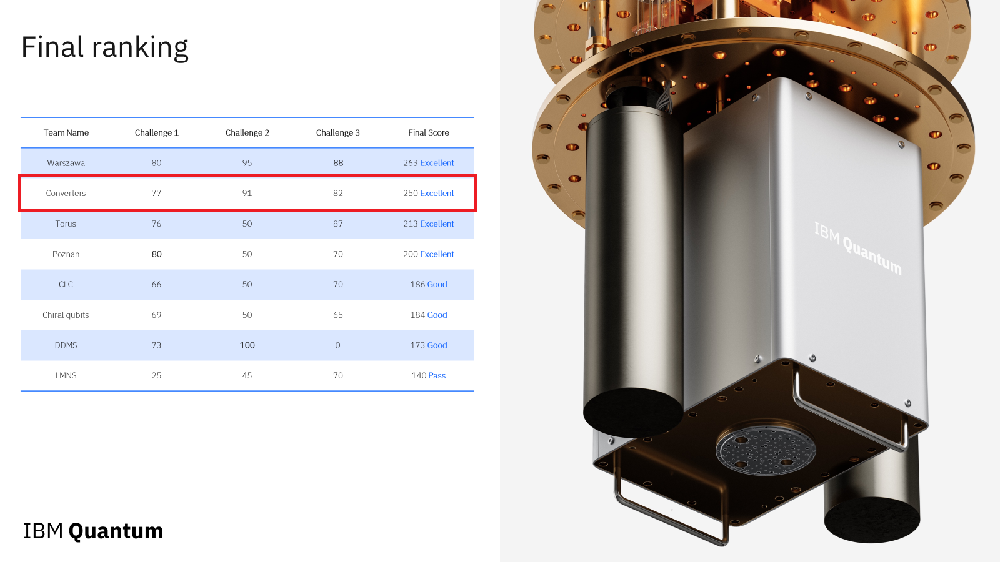
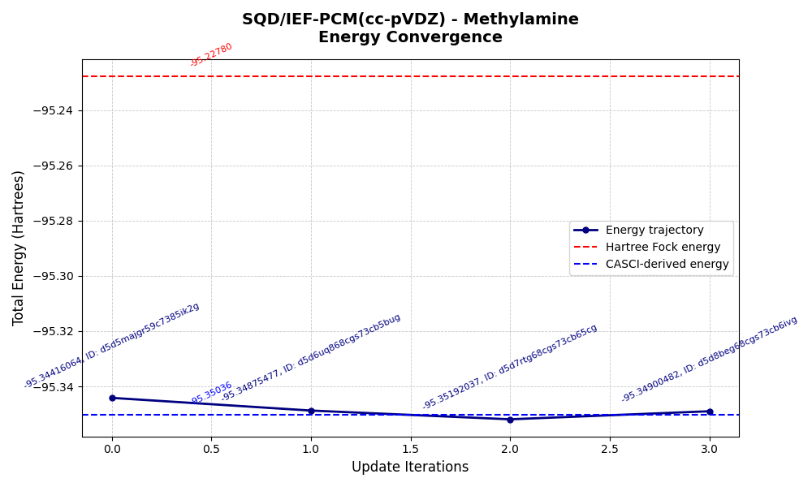
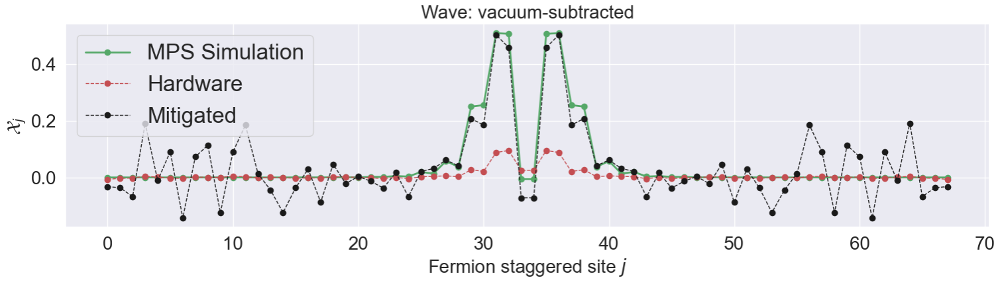

# R2P Capstone Project

## Overview

This repository contains the **Road to Practitioner (R2P) Capstone Project** — the final assessment designed to test and consolidate the knowledge gained after 3 months of intensive quantum computing courses and hands-on homework.

The R2P program prepares participants to become quantum practitioners capable of tackling real-world quantum challenges. Successfully completing this capstone demonstrates readiness to apply quantum computing concepts in practical scenarios.

---

## 🏆 Final Ranking

We, **Team Converters** achieved **2nd place** with an **Excellent** rating!



---

## Table of Contents

- [Challenge 1: Quantum Multi-Objective Optimization (QMOO)](#challenge-1-quantum-multi-objective-optimization-qmoo)
- [Challenge 2: Implicit Solvent](#challenge-2-implicit-solvent)
- [Challenge 3: Hadron-Schwinger](#challenge-3-hadron-schwinger)
- [Installation](#installation)
- [Requirements](#requirements)

---

## Challenge 1: Quantum Multi-Objective Optimization (QMOO)

**Directory:** [`qmoo/`](./qmoo/) | **Score: 77/100**

This challenge explores quantum approaches to multi-objective optimization problems, comparing quantum and classical methods for solving complex optimization instances.

**Key Tasks:**
- Implemented and analyzed quantum optimization algorithms for multi-objective problems
- Compared performance metrics (Hypervolume) across different approaches including MPS simulation, IBM quantum hardware (`ibm_fez`), ε-CM, DCM, and DPA-a
- Evaluated solution quality and convergence behavior over time
- Benchmarked quantum results against classical optimization baselines


---

## Challenge 2: Implicit Solvent

**Directory:** [`implicit-solvent/`](./implicit-solvent/) | **Score: 91/100**

This challenge focuses on quantum chemistry simulations using the implicit solvent model with the `ffsim` library to perform molecular energy calculations.

**Key Tasks:**
- Simulated molecular systems (Methylamine) using quantum computational chemistry methods
- Implemented SQD/IEF-PCM with cc-pVDZ basis set for energy calculations
- Tracked energy convergence trajectories compared to Hartree-Fock and CASCI-derived energies
- Achieved ground state energy optimization through iterative updates



---

## Challenge 3: Hadron-Schwinger

**Directory:** [`hadron-schwinger/`](./hadron-schwinger/) | **Score: 82/90**

This challenge simulates hadron wavepacket propagation in the Schwinger model on IBM quantum hardware, using a 68-qubit lattice system.

**Key Tasks:**
- Prepared initial quantum states using SC-ADAPT-VQE on a lattice with L=34 spatial sites (68 qubits)
- Implemented Suzuki-Trotter time evolution algorithms for Hamiltonian dynamics
- Executed circuits on both classical simulators and IBM quantum computers
- Analyzed wavepacket propagation and observed characteristic quantum behavior over time steps



---

## Installation

Refer to [`Guide_and_install.ipynb`](./Guide_and_install.ipynb) for detailed setup instructions.

### Quick Start (Mac/Linux)

```bash
# Create and activate virtual environment
python -m venv .venv
source .venv/bin/activate

# Install dependencies
pip install -r requirements.txt
```

### Windows

```bash
# Create and activate virtual environment
python -m venv .venv
.venv\Scripts\activate

# Install dependencies (Windows-specific)
pip install -r requirements-windows.txt
```

> **Note:** Challenge 2 (Implicit Solvent) requires the `ffsim` library, which is not supported on Windows.

---

## Requirements

- Python 3.x
- IBM Quantum account (for hardware experiments)
- See `requirements.txt` or `requirements-windows.txt` for full dependency list

---

## Project Structure

```
R2P_Capstone/
├── Guide_and_install.ipynb    # Installation guide and project overview
├── LICENSE                    # CC BY-NC 4.0 License
├── Ranking.png                # Final competition ranking
├── qmoo/                      # Challenge 1: Quantum Multi-Objective Optimization
├── implicit-solvent/          # Challenge 2: Implicit Solvent simulations
├── hadron-schwinger/          # Challenge 3: Hadron-Schwinger model
├── requirements.txt           # Dependencies (Mac/Linux)
└── requirements-windows.txt   # Dependencies (Windows)
```

---

## License

This project was completed as part of the R2P Quantum Computing program and is licensed under the **Creative Commons Attribution-NonCommercial 4.0 International (CC BY-NC 4.0)**. See the [LICENSE](./LICENSE) file for details.
